# TP1 - Git : Nada El Omrani Merini

## 🎯 Objectif
Apprendre et maîtriser les commandes de base de Git en ligne de commande.

---

## 🛠️ Étapes réalisées

### 1. Initialisation du dépôt
- Création du dossier `TP1-NadaElOmraniMerini1`
- Initialisation du dépôt avec `git init`

### 2. Suivi des fichiers
- Ajout des fichiers avec `git add`
- Vérification de l'état avec `git status`

### 3. Commits
- Configuration du profil Git (nom et email)
- Création de plusieurs commits avec `git commit`

### 4. Gestion du fichier `.gitignore`
- Ajout du fichier `credentials`
- Suppression du suivi du fichier

### 5. Gestion des branches
- Création de la branche `dev`
- Ajout de commits sur `dev`
- Fusion (merge) de `dev` vers `master` via Pull Request

### 6. les Etapes en ordre :
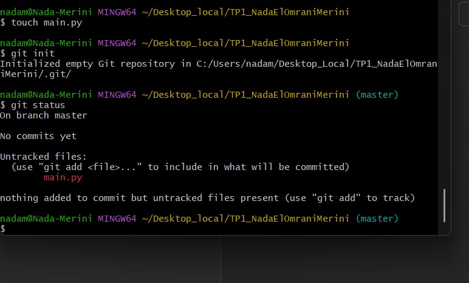
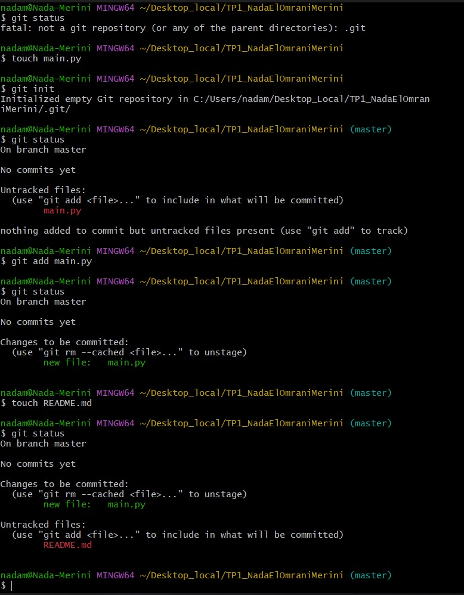
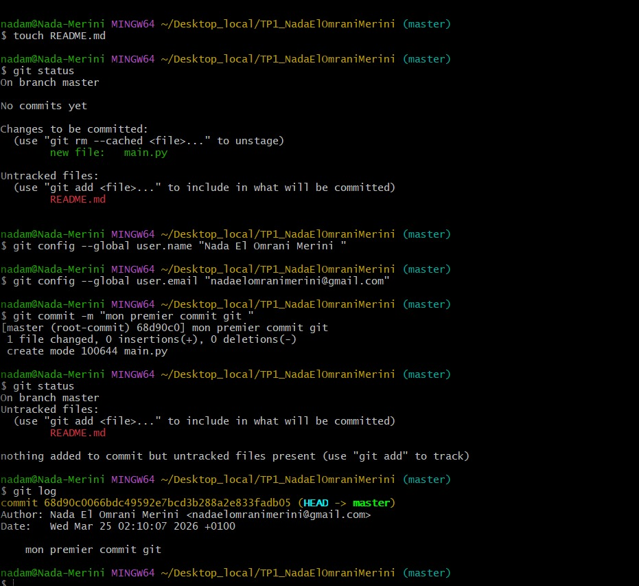
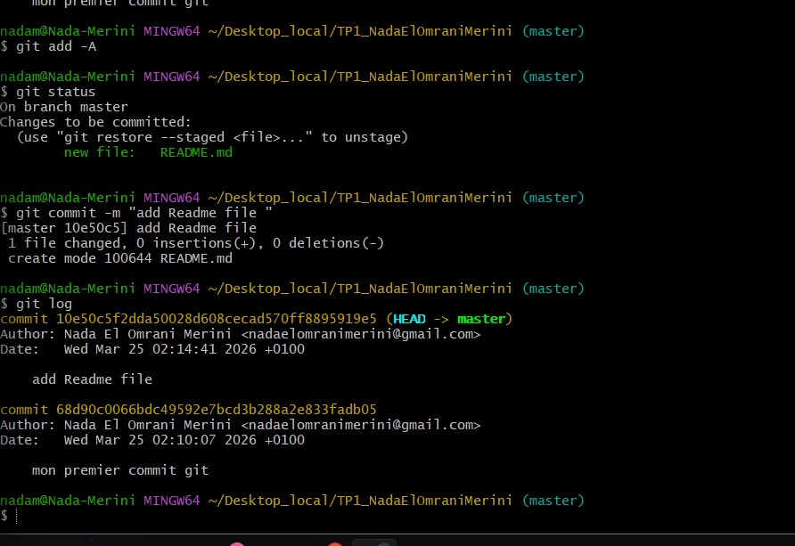
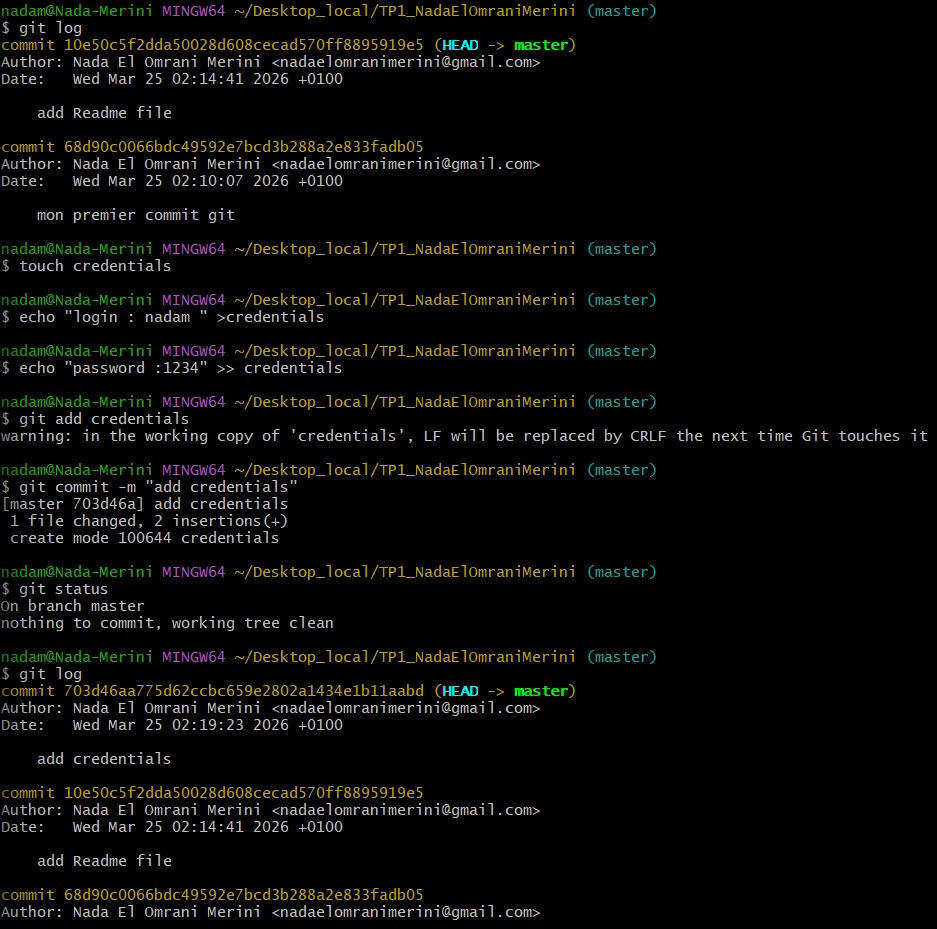
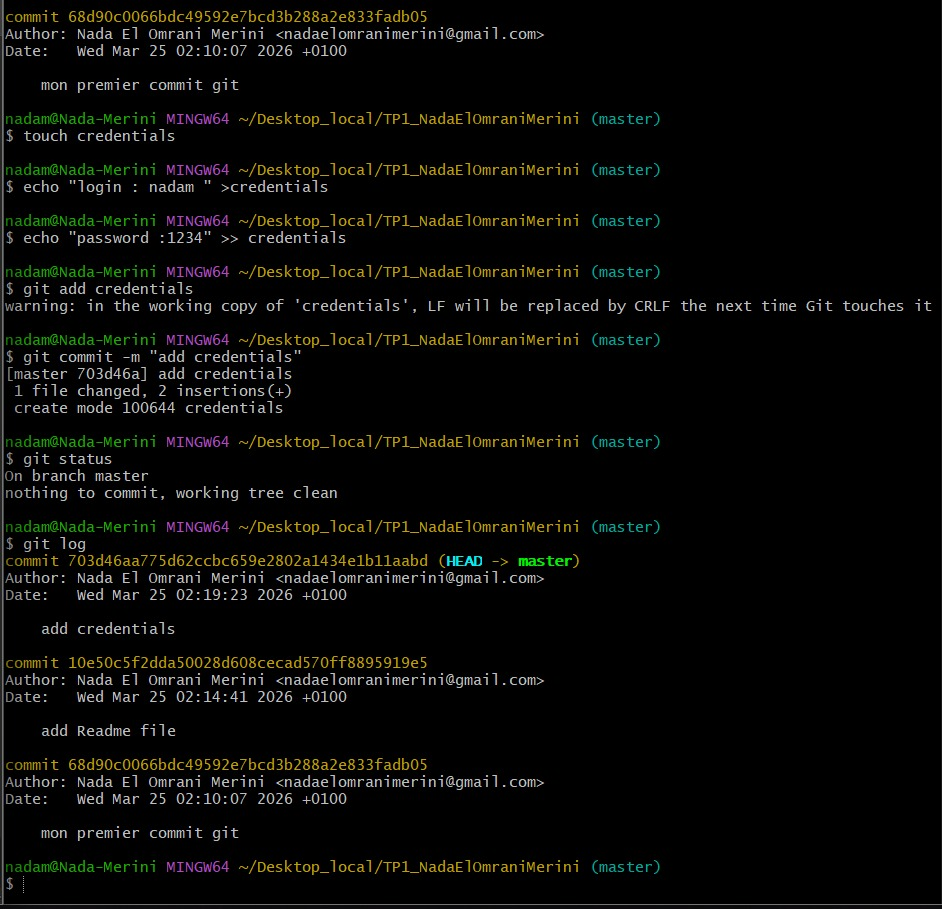
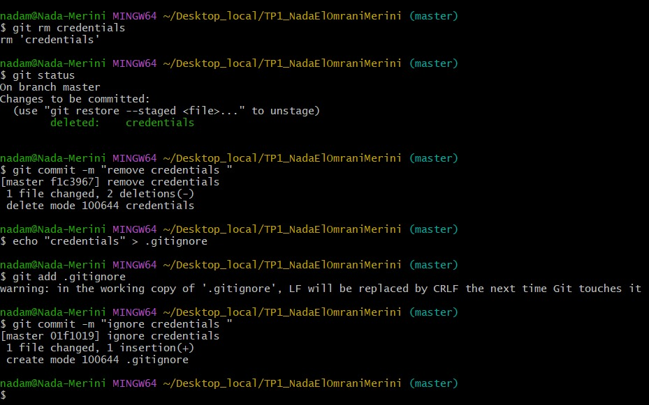
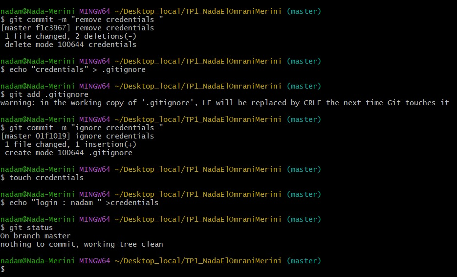
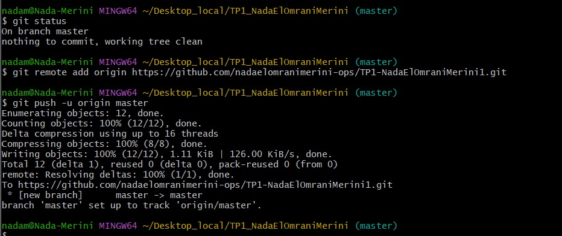
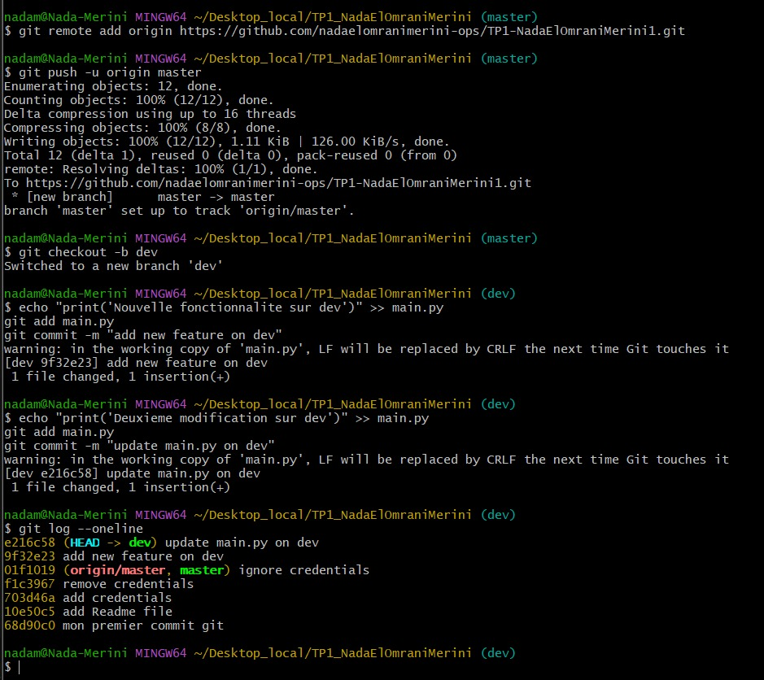
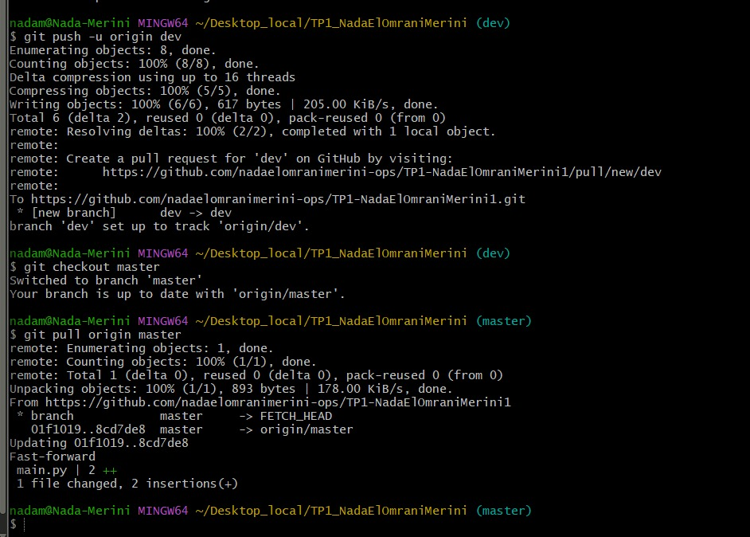

